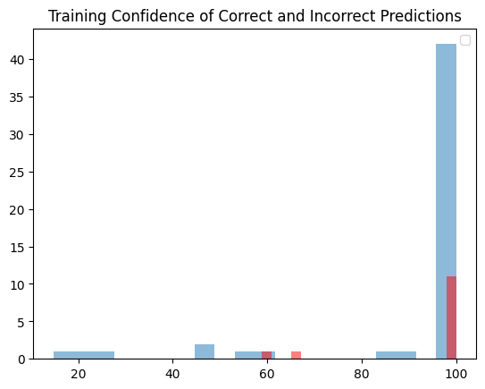

# Bowlmania22
This is trying to absolutely clown some geezers in a bowl pickem. After much delibaration the final model used to produce a reasonable output is a zero mean unit variance transformation into a Gaussian Naive Bayes classifier. 

The transformer was chosen because some columns had a very high variance but after doing PCA there weren't many columns with high correlation. The GNBC was chosen because it is tolerant of high variance, is somewhat resistant to overfitting, and is stupid easy to implement. Not to mention performed higher than a shallow nerual network, deep neural network, random forest, and some other fanciness I played around with. 

# Process

## Data Origin
The data is a hybrid of three Kraggle data sets:

- [Last 120 Years of Bowl Games](https://www.kaggle.com/datasets/mattop/college-football-bowl-games-1902-2022)
- [Last 8 Years of Historical Team Data](https://www.kaggle.com/datasets/jeffgallini/college-football-team-stats-2019/code?resource=download&select=cfb21.csv)

The latter inspired the `scripts/scrape.py` script I created to be able to scrape 2022-23 data from NCAA's stats page. 

## Training 

The training data took the shape of the last 8 years of bowl games and the last 8 years of team data. Specifically the model was trained on a super vector composed of the all the data provided by the NCAA for each team (roughly 300 values). 

The test data was 20% of the training data randomly selected.

## Predicting

To predict this years bowl games I used the same process as the training data but used 2022-23 performace data. 

## Ranking

Part of using `sklearn` is that it has a built in `predict_proba` function that returns the probability of each class. I used this to rank the teams in each bowl game based on how confident my model was in each prediction.

# Shortcomings

- My model was either very confident or very unconfident in its predictions. Meaning that it was either very sure a team would win or very sure a team would lose. This is a problem because it is very hard to rank teams when there is a large gap between the most confident and least confident prediction. I am not sure how to best remedy this other than getting more performance data to be able to train on more years of bowl games. 
- I was interested in also making a general game predictor given how a team has performed the last 4 years (assuming some of those playesrs would still be on the team/skill carryover) but this proved beyond the scope of the project.

# Results

I should probably have a confussion matrix here but I was too tired to make one. Check out this bar graph.

## Testing Confidence

This shows the confidence of the model both when it is right and wrong. We can see that it is very confident when it is right and wrong which is somewhat problematic and subject to future improvements.

## Predictions

The bolded team is my predicted winner along with how my model ranked that pick. Please excuse any goofy formating, that wa from sanitizing the data for the model.

|rank|team 0|team 1|
|:---:|:---:|:---:|
|42|**florida state**|oklahoma|
|41|**boise state**|northtexas|
|40|**southern miss**|rice|
|39|**wisconsin**|oklahoma state|
|38|**maryland**|north carolina state|
|37|**notre dame**|south carolina|
|36|**illinois**|mississippi state|
|35|**new mexico state**|bowling green|
|34|**michigan**|tcu|
|33|georgia|**ohio state**|
|32|**utah state**|memphis|
|31|**san jose state**|easternmich|
|30|southern california|**tulane**|
|29|**air force**|baylor|
|28|texas tech|**olemiss**|
|27|**uconn**|marshall|
|26|nc state|**oregon**|
|25|florida|**oregonstate**|
|24|middle tenn|**san diego state**|
|23|**arkansas**|kansas|
|22|**east carolina**|coastal carolina|
|21|syracuse|**minnesota**|
|20|cincinnati|**louisville**|
|19|georgia southern|**buffalo**|
|18|**missouri**|wake forest|
|17|**houston**|louisiana|
|16|lsu|**purdue**|
|15|**south alabama**|western kentucky|
|14|ucla|**pittsburgh**|
|13|**byu**|smu|
|12|**miami (oh)**|uab|
|11|toledo|**liberty**|
|10|texas|**washington**|
|9|**duke**|ucf|
|8|**kentucky**|iowa|
|7|clemson|**tennessee**|
|6|alabama|**kansas state**|
|5|troy|**utsa**|
|4|fresno state|**washingtonstate**|
|3|utah|**penn state**|
|2|ohio|**wyoming**|